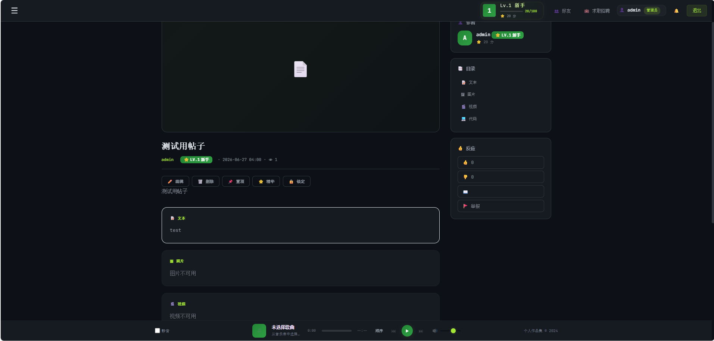
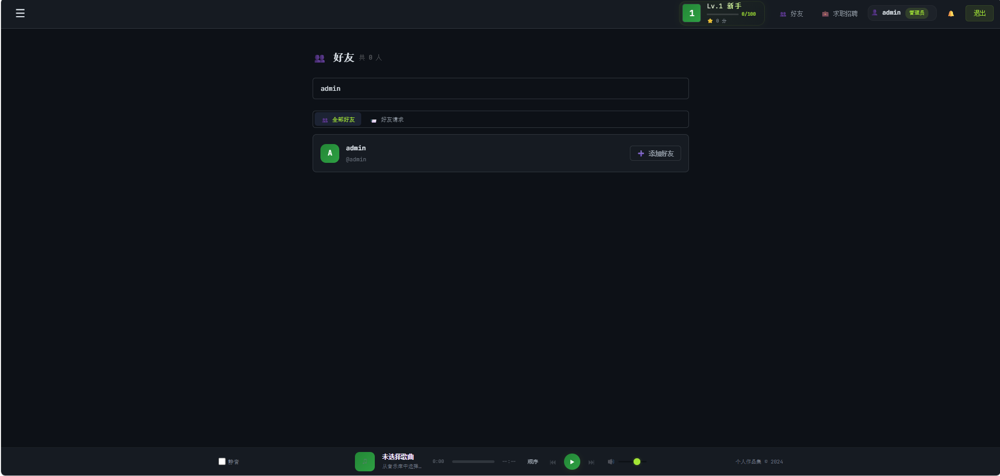
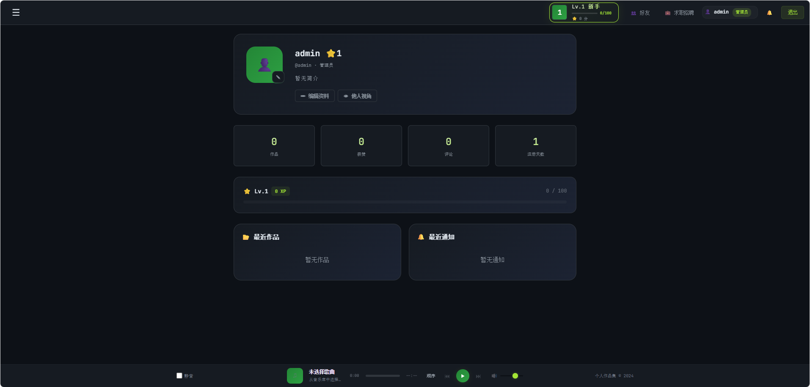
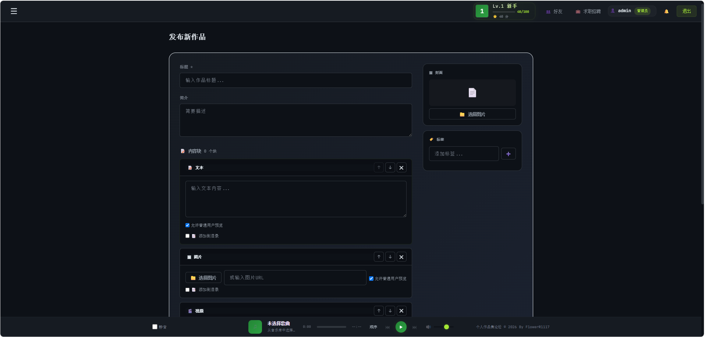
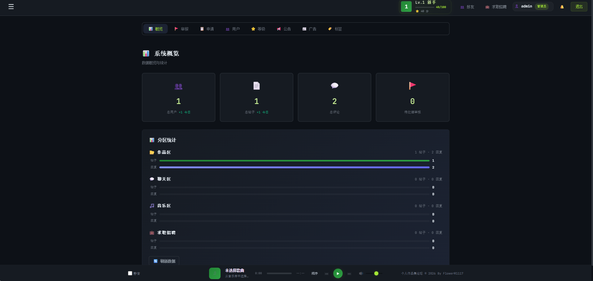

# Portfolio 作品集网站

基于 Node.js + Express + better-sqlite3 (SQLite) 的全栈个人作品集管理系统。

## 功能特性

- **用户系统**：注册/登录，管理员/普通用户，等级和积分
- **作品管理**：发布/编辑/删除帖子，多类型内容块（文本/图片/视频/代码/附件）
- **附件系统**：等级锁定、积分解锁、积分下载三级权限控制
- **评论系统**：嵌套回复、编辑/删除
- **好友/私信**：好友申请、在线状态、即时消息
- **音乐播放器**：上传歌曲、创建歌单、公开分享、底部播放栏
- **收藏夹**：创建收藏夹、收藏帖子
- **举报系统**：举报帖子/用户、管理员处理
- **等级系统**：XP 经验值、等级分区权限
- **管理面板**：用户管理、禁言、数据统计、等级配置
- **响应式设计**：适配手机/平板/桌面，暗色主题

## 部分界面预览

| 帖子界面 | 好友界面 | 个人主页 |
|:--------:|:--------:|:--------:|
|  |  |  |

| 发帖界面 | 管理员界面 |
|:--------:|:----------:|
|  |  |

## 快速开始

### 1. 安装依赖

```bash
npm install
```

### 2. 配置环境变量

复制 `.env.example` 为 `.env` 并修改配置：

```bash
cp .env.example .env
```

| 变量 | 说明 | 默认值 |
|------|------|--------|
| `SESSION_SECRET` | Session 密钥（必须修改） | 无默认值，未设置则拒绝启动 |
| `ADMIN_SECRET` | 管理员注册秘钥 | `AdminKey123` |
| `PORT` | 服务端口 | `3001` |
| `DB_PATH` | 数据库路径 | `./database.db` |
| `ALLOW_NEW_DB` | 允许创建新数据库 | `1`（首次运行时设置） |

### 3. 启动服务

```bash
npm start
```

或双击 `start.bat`（Windows）

访问 `http://localhost:3001`

## 注册账号

首次启动后需要自行注册账号：

- **普通用户**：直接注册，无需秘钥
- **管理员**：勾选"注册为管理员"，需输入 `ADMIN_SECRET` 秘钥

## 项目结构

```
├── server.js              # Express 入口 + session 存储
├── config.js              # 统一配置管理
├── db/
│   ├── init.js            # better-sqlite3 初始化 + 查询辅助
│   ├── schema.js          # CREATE TABLE 语句
│   ├── migrations.js      # 版本化迁移
│   └── seeds.js           # 种子数据（等级配置、默认设置）
├── middleware/
│   ├── auth.js            # 认证中间件
│   ├── upload.js          # 文件上传 (multer)
│   ├── zoneAccess.js      # 分区访问控制
│   └── errorHandler.js    # 全局错误处理
├── services/
│   ├── AuthService.js     # 认证业务
│   ├── PostService.js     # 帖子业务
│   ├── LevelService.js    # XP/升级/积分
│   ├── FileService.js     # 文件业务
│   ├── NotificationService.js  # 通知业务
│   └── LoginNoticeService.js   # 登录公告
├── routes/                # 路由文件
├── models/                # 数据模型
├── public/
│   ├── index.html         # SPA 入口
│   ├── css/style.css      # 样式
│   └── js/
│       ├── app.js         # 主应用
│       ├── api.js         # API 封装
│       ├── router.js      # 哈希路由
│       ├── music.js       # 音乐播放器
│       ├── utils.js       # 工具函数
│       └── components/    # 页面组件
└── docs/                  # 文档
    ├── architecture.md    # 架构文档
    ├── api-reference.md   # API 参考
    └── user-guide.md      # 用户指南
```

## API 文档

完整 API 文档见 [`docs/api-reference.md`](docs/api-reference.md)

## 文档

详细文档请查看 [`docs/`](docs/) 目录：

- [架构文档](docs/architecture.md) - 系统架构、技术栈、数据流
- [API 参考](docs/api-reference.md) - 全部后端 API 端点
- [用户指南](docs/user-guide.md) - 功能使用说明

## 技术栈

| 层级 | 技术 |
|------|------|
| 后端框架 | Express |
| 数据库 | better-sqlite3 (SQLite) |
| 会话管理 | express-session |
| 认证 | bcryptjs |
| 文件上传 | multer |
| 安全 | helmet + express-rate-limit |
| 日志 | winston |
| 前端 | 原生 JS SPA |

## License

[GPL-3.0](LICENSE)
